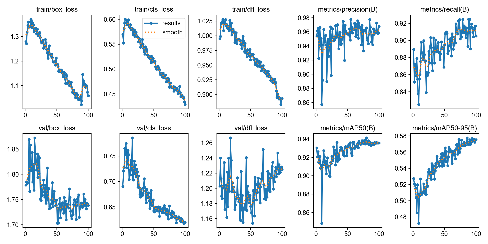
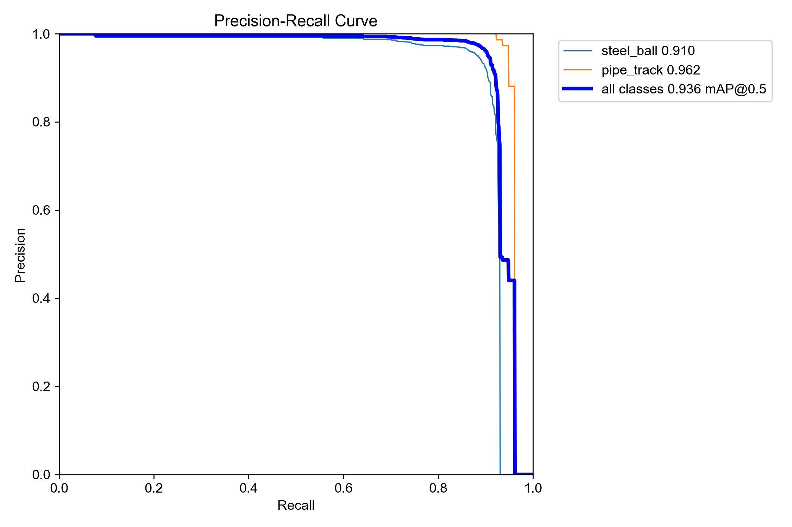

# 车载平衡滚球系统——视觉识别与坐标通信模块

本仓库整理自全国大学生电子设计竞赛作品中的视觉子系统。该模块使用 MaixCAM 采集图像，通过轻量化 YOLO 模型识别钢球与轨道，计算钢球相对轨道中心的位置，并通过 UART 将毫米级偏移量发送给主控制器。

> 本仓库仅包含本人负责的视觉识别、数据集、模型部署和坐标通信部分，不包含团队其他成员完成的运动控制与执行机构代码。

## 主要功能

- 识别钢球 `steel_ball` 与轨道 `pipe_track`
- 对检测结果进行平滑和运动补偿
- 根据轨道实际长度将像素坐标换算为毫米坐标
- 通过 UART 实时发送钢球相对轨道中心的偏移量
- 提供完整的 YOLO 格式训练数据集
- 提供 PyTorch、ONNX 与 MaixCAM CVIMODEL 模型

## 系统流程

```text
MaixCAM 摄像头
      ↓
YOLO 识别钢球与轨道
      ↓
检测平滑、运动预测与尺度标定
      ↓
计算相对轨道中心的偏移量（mm）
      ↓
UART 115200 8N1
      ↓
主控制器
```

## 目录结构

```text
pipe-ball-vision/
├─ dataset/     完整 YOLO 数据集（训练集、验证集及标签）
├─ deploy/      MaixCAM 端视觉识别与串口发送程序
├─ models/      PyTorch、ONNX、CVIMODEL 模型及 MUD 文件
├─ tools/       MaixCAM 数据采集和 PC 端视频接收工具
├─ docs/        中文 UART 通信协议
└─ assets/      标注效果演示视频
```

## 数据集

数据集采用 YOLO 检测格式，包含 **2514 张图片和 2514 个对应标签文件**，类别定义如下：

```text
0: steel_ball
1: pipe_track
```

目录结构：

```text
dataset/
├─ data.yaml
├─ images/
│  ├─ train/
│  └─ val/
└─ labels/
   ├─ train/
   └─ val/
```

使用 Ultralytics YOLO 训练时，可执行：

```bash
yolo detect train model=yolo11n.pt data=dataset/data.yaml epochs=100 imgsz=640
```

## MaixCAM 部署

1. 将 `models/pipe_ball_final_v6.mud` 和 `models/pipe_ball_final_v6_int8.cvimodel` 上传到 MaixCAM 的同一模型目录。
2. 将 `deploy/main_uart_realtime_v11.py` 上传至设备并运行。
3. 如果模型保存位置不同，请修改程序顶部的 `MODEL_PATH`。
4. MaixCAM 的 A19（TX）连接主控制器 RX，双方 GND 必须相连。

串口数据帧及 CRC8 校验规则见 [`docs/uart_protocol.md`](docs/uart_protocol.md)。

## 核心文件

- `deploy/main_uart_realtime_v11.py`：实时视觉检测、坐标计算与 UART 输出程序。
- `models/pipe_ball_final_v6_int8.cvimodel`：部署到 MaixCAM 的 INT8 模型。
- `models/best.pt`：PyTorch 模型。
- `models/best.onnx`：ONNX 模型。
- `dataset/data.yaml`：YOLO 数据集配置。

## 模型结果

V6 验证结果：Precision 0.969、Recall 0.840、mAP50 0.922、mAP50-95 0.539。

### 训练与验证指标

下图展示模型训练过程中的损失、Precision、Recall、mAP50 和 mAP50-95 变化：



### Precision–Recall 曲线



标注效果可查看 [`assets/annotation_preview.mp4`](assets/annotation_preview.mp4)。
